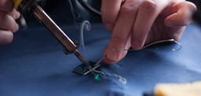
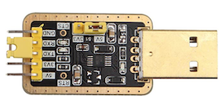
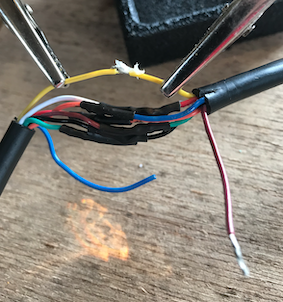
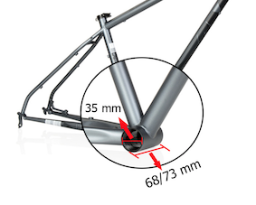

# Fitting a TongSheng TSDZ2 mid drive motor with an 8 pin controller to a 52v battery and the Bafang 860C LCD

<!-- TOC -->

- [Fitting a TongSheng TSDZ2 mid drive motor with an 8 pin controller to a 52v battery and the Bafang 860C LCD](#fitting-a-tongsheng-tsdz2-mid-drive-motor-with-an-8-pin-controller-to-a-52v-battery-and-the-bafang-860c-lcd)
- [Building a `bootloader` to flash the 860c display](#building-a-bootloader-to-flash-the-860c-display)
  - [Skills](#skills)
  - [Tips](#tips)
  - [Tools that I used.](#tools-that-i-used)
  - [Sourcing components and building the bootloader.](#sourcing-components-and-building-the-bootloader)
  - [Adjusting the output voltage from the DC Booster](#adjusting-the-output-voltage-from-the-dc-booster)
- [Flashing the firmware of the TSDZ2 motor controller](#flashing-the-firmware-of-the-tsdz2-motor-controller)
  - [ST-Link V2 pinouts](#st-link-v2-pinouts)
  - [Connecting the 860C display to the 8pin TSDZ2 harness.](#connecting-the-860c-display-to-the-8pin-tsdz2-harness)
  - [Collected information](#collected-information)

<!-- /TOC -->

There is not much original content here, I am walking in the footsteps of those who know more than me, but hope that pulling all the threads together that I needed is of help to those who follow. I hope that I have given all the credits and references that are due, but if I have missed anything, then please contact me and I will happily update this content.

I am in no way trying to place product here. Any images or links are provided as samples that illustrate the story and as they worked for me. There are likely to be other ways to achieve the same result, but this journal is here to chronicle my journey.

Any prices quoted here are only indicative and there will be options at different prices. Listed here to help you understand outline costs.

# Building a `bootloader` to flash the 860c display

See the following for the original reference materials.

[TSDZ2 Wiki](https://github.com/OpenSource-EBike-firmware/TSDZ2_wiki/wiki/Flash-the-firmware-on-860C-850C-using-bootloader)

[Eco Cycles](https://www.eco-ebike.com/blogs/eco-cycles-instructionals/850c-tsdz2-open-source-firmware-bootloader-update-tutorial)

## Skills

I am not an expert in this topic, but if you can do some basic soldering, have some basic PC skills and can follow a recipe, then this should be well within your grasp. This is 90% planning and 10% execution.

## Tips

1. Read and understand, don't learn and make mistakes as you go.
2. Think, think some more, think again and then cut.

## Tools that I used.

  
  
  
  
  

- Multimeter - 0 volts to 40 volts DC.
- Watch makers screwdrivers to adjust output voltage of XL6009 DC Step Up converter.
- Heatshrink tubing to provide electrical isolation and assembly strength. `£2`
- Dupont wires for connecting components. You will need the female ended connectors, suggest you buy female/female wires as you will need them to flash the TSDZ2. `£2`
- Solder / Flux / Iron - I assume that you have access to these already.

## Sourcing components and building the bootloader.

I have used the schematic from [here](https://github.com/OpenSource-EBike-firmware/TSDZ2_wiki/wiki/Flash-the-firmware-on-860C-850C-using-bootloader)

From    | Pin | Colour | Pin | Via    | Pin  | Colour | To
--------|-----|--------|-----|--------|------|--------|-------
CHG340G | 5V  | Brown  | IN+ | XL6009 | OUT+ | Brown  | HIGO B
CHG340G | GND | Black  | IN- | XL6009 | OUT- | Black  | HIGO B
CHG340G | TXD | White  | --> | ---->  | -->  | White  | HIGO B
CHG340G | RXD | Green  | --> | ---->  | -->  | Green  | HIGO B

Following the recipe [here](https://github.com/OpenSource-EBike-firmware/TSDZ2_wiki/wiki/Flash-the-firmware-on-860C-850C-using-bootloader), I sourced the following parts.

1. `A CH340G RS232 to USB TTL Auto Converter Adapter` to take the signal from the `APT Burn Tools` updating software and deliver it to the `860c` LCD display. `£3.20`

[EBAY Search](https://www.ebay.co.uk/sch/i.html?_from=R40&_trksid=m570.l1313&_nkw=CH340+Gold+USB+TTL&_sacat=0)

2. `A 5 pin Higo Mini B extension cable - male to male`. You will cut this in half, use 1 half to create the bootloader, and the other will attach to the end of the 860c LCD connection to the motor controller. `£10`

[Amazon search](https://www.amazon.co.uk/Bafang-Extended-Cable-Display-750C/dp/B07GDL1TSN/ref=sr_1_3?dchild=1&keywords=Higo+Mini+A+cable+bafang&qid=1593279954&sr=8-3)

3. `An XL6009 DC-DC Voltage Step Up Boost Converter` to take a 5V supply from your laptop and then boost it to the 30v required to drive the 860C LCD while it is being updated. `£3`

[Ebay search](https://www.ebay.co.uk/sch/i.html?_from=R40&_trksid=p2334524.m570.l1313.TR2.TRC1.A0.H0.XXL6009.TRS0&_nkw=XL6009&_sacat=0&LH_TitleDesc=0&_osacat=0&_odkw=Higo+Mini+A+cable+5+pin)

When assembled, the `bootloader` looked liked this for me and would have cost about `£20` if I had had to buy all the bits. There are other components that you can use and I am sure that it could be completed the build for less money.

Now that we have built the `bootloader`, we need to adjust the voltage supply that will reach the 860c display LCD as we have a 5 volt supply coming from the USB port on your PC but we need a 30 volt supply to the 860c.

## Adjusting the output voltage from the DC Booster

Check that the jumpers on your `CH340G` are set to provide `5 volts` and not `3.3 volts` as below.

You will see that the USB connection from your laptop will supply 5 volts to the `in+` `in-` side of the `XL6009 DC Step up boost converter`.

Check the voltage delivered to the `XL6009` ....

We now need to adjust the `XL6009` so that we are delivering the required voltage to the `860c` LCD display.

You need to adjust the potentiometer (little screw on the blue block) so that the output voltage from the buck converter is 30 volts. You will need to use your multimeter to measure the DC voltage on the `+out` and `-out` side of the `XL6009`.

Now we have 30 volts output and are ready to flash the `860c` LCD display.

# Flashing the firmware of the TSDZ2 motor controller

You will need

1. An `ST-Link V2` to provide the link from the software on your PC to the `throttle sensor` inputs to your TSDZ2 motor controller. Some `ST-Link V2` sellers provide 4 x Dupont connectors, but you will need a total of `7` connectors if you are building a `bootloader` to flash your 860C display and are flashing your TSDZ2 motor controller.

Remember that the software versions on the controller and display operate as a pair, so you are upgrading both if you are upgrading any.

`£3`

[Ebay Search](https://www.ebay.co.uk/sch/i.html?_from=R40&_trksid=p2047675.m570.l1311.R1.TR5.TRC1.A0.H0.Xst-link.TRS0&_nkw=st+link+v2&_sacat=0)

.....

`ST-Link V2` connected to the `throttle` connector from the TSDZ2 harness

When complete, you will see `update complete` on the PC screen.

2. `Dupont` wire connectors - female to female.

`£2`

[Ebay search](https://www.ebay.co.uk/sch/i.html?_from=R40&_trksid=m570.l1313&_nkw=femal+female+dupont&_sacat=0&LH_TitleDesc=0&_osacat=0&_odkw=st+link+v2)

## ST-Link V2 pinouts

I have found that the pin outs on the `ST-Link V2` vary, so have a look at the diagram on the face of the device and understand how your pinouts are organised.

# Connecting the 860C display to the 8pin TSDZ2 harness.

Others have been here before me and special thanks to `Ben Garside` (bejam) on the [endless-sphere ](https://endless-sphere.com/forums/viewtopic.php?f=30&t=93818&p=1575340&hilit=bejam#p1575340) website for his support.

Before we start, here is an overview of what we are going to do.

To do this we will need ....

1. An `8pin female Higo cable`

I sourced mine on `Ebay` by searching on `Higo Waterproof Connector 2 3 4 5 6 8 pin cable lead 1m ebike electric bafang`

`£8.99` in my case.

Here is a picture of the TSDZ2 with associated cables.

This needs connecting to the 8pin harness from the `TSDZ2` motor, so you will need remove the existing female Higo connector and then reconnect the wires from the 8pin harness cable to the 8pin Higo cable. The wires are the same colour, but they need to be connected as follows:-

8pin female Higo cable | 8pin 1T4 cable from TSDZ2 | Function
-----------------------|---------------------------|---------
blue                   | brown                     | P+
red                    | orange                    | Pl
yellow                 | yellow                    | Rx
white                  | red                       | 5V
green                  | white                     | brake
orange                 | blue                      | throttle
brown                  | green                     | Tx
black                  | black                     | GND

`Helping Hands` are a great help for this job. Make sure that you insulate each solder joint with shrink wrap and then shrink wrap the completed bundle again to provide strength and protection from the elements.

When complete but before final weather proofing.

2. You will need a harness that you connect to your new 8 pin female Higo connector on your `TSDZ2` motor harness that then splits to feed display, brakes (2) and throttle. The image below gives a good overview of the connectors in the harness and what they are used for.

I again sourced by cable on `Ebay` using a `Ebike Accessories Harness Higo 1T4 Wiring Cable for Bafang Mid Motor Kit BBS0102` search and paid `£13.99`.

# Other collected information

[Bafang BBSHD Wiring Diagram](https://endless-sphere.com/forums/viewtopic.php?f=28&t=79788&start=5200)

[Bottom bracket dimensions](https://greenpedel.en.made-in-china.com/product/UNSnMspdyyWh/China-Greenpedel-MID-Drive-Motor-Tsdz-2-36V-500W-Electric-Bicycle-Motor-Kit.html)

[Ebay search](https://www.ebay.co.uk/sch/i.html?_from=R40&_trksid=m570.l1313&_nkw=IDC+10+PIN+Female+Header+FC-10+2.54+mm+pitch+Socket+Connector+&_sacat=0&LH_TitleDesc=0&_osacat=0&_odkw=IDC+10+PIN+Female+Header+FC-10+2.54+mm+pitch+Socket+Connector+In+NSNJ)

