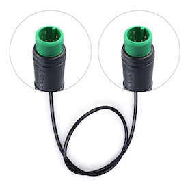

# Fitting a TongSheng TSDZ2 mid drive motor with an 8 pin controller to a 52v battery and the Bafang 860C LCD

There is not much original content here, I am walking in the footsteps of those who know more than me, but hope that pulling all the threads together that I needed if of help to those who follow. I hope that I have given all the credits and references that are due, but if I have missed anything, then please contact me and I will happily update this content.

## Building a bootloader to flash the 860c display

Following the recipe [here](https://github.com/OpenSource-EBike-firmware/TSDZ2_wiki/wiki/Flash-the-firmware-on-860C-850C-using-bootloader) I sourced the following parts.

1. `A 5 pin Higo Mini A extension cable - male to male`. You will cut this in half, use 1 half to create the bootloader, and the other will attach to the end of the 860c LCD connection to the motor controller.

2. `An XL6009 DC-DC Voltage Step Up Boost Converter` to take a 5V supply from your laptop and then boost it to the 30v required to drive the 860C LCD while it is being updated.

